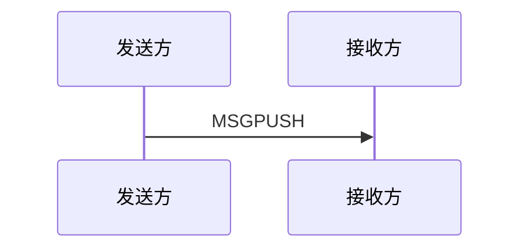
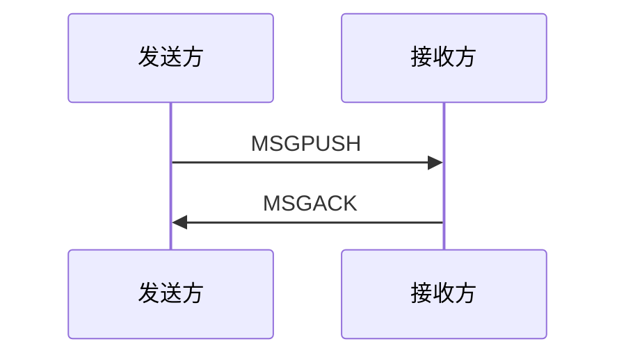
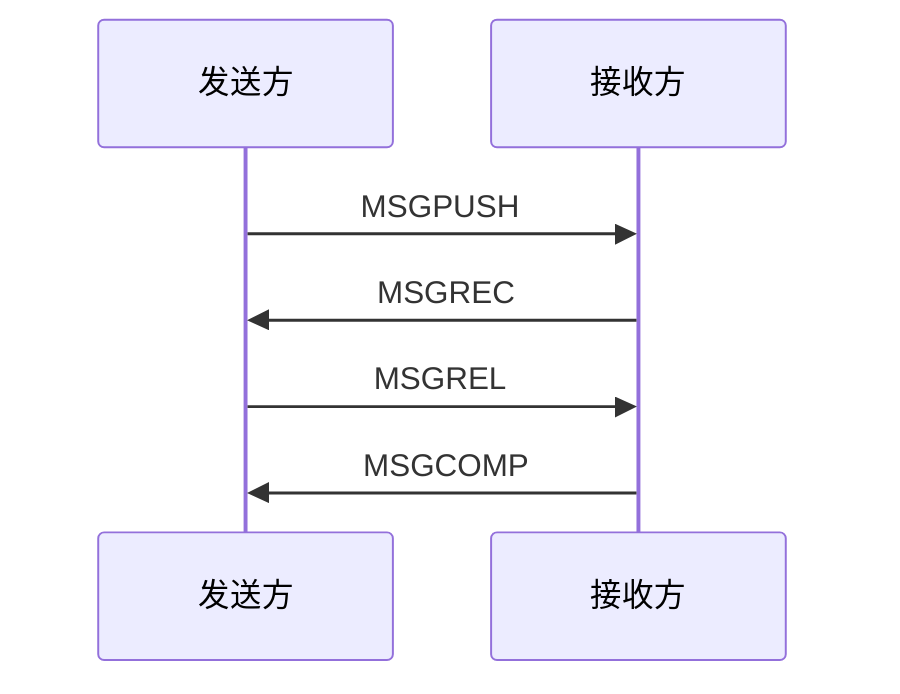

# Simple Datagram Control Protocol Manual

## 1、介绍

## 2、定义

### 2.1 协议帧组成

协议帧 = 同步头 + 固定头 + 数据长 + [帧识别码] + 端口号 + 用户数据 + 校验码

| 序号 | 项目       | 定义名       | 长度        | 功能说明                                                |
| ---- | ---------- | ------------ | ----------- | ------------------------------------------------------- |
| 1    | 同步头     | sync_code    | n Bytes     | 用于标记一个帧的开始                                    |
| 2    | 固定头     | fixed_header | 1 Byte      | 用于说明此帧数据的功能和数据组成等                      |
| 3    | 数据长     | data_len     | 1 ~ 2 Bytes | 帧识别码+端口号长度+用户数据长度+校验码长度             |
| 4    | [帧识别码] | [frame_id]   | 2 Bytes     | 帧识别码，当QoS为1或2时会出现此数据                     |
| 5    | 端口号     | prot_num     | 2 Bytes     | 提供给用户寻址使用                                      |
| 6    | 用户数据   | user_data    | n Bytes     | 用户发送的数据内容                                      |
| 7    | 检验码     | check_crc16  | 2 Bytes     | 采用CRC16 Modus校验，检验范围 [ 固定头开始 , 用户数据 ] |

### 2.2 固定头(FIXED_HEADER)

固定头 = 消息类型 + 服务质量 + 数据长度 + 扩展标记

| 序号 | 项目     | 定义名        | 长度   | 功能说明                        |
| ---- | -------- | ------------- | ------ | ------------------------------- |
| 1    | 消息类型 | message_type  | 4 Bits | 用于说明当前包的功能            |
| 2    | 服务质量 | qos_level     | 2 Bits | 支持3种不同的服务质量           |
| 3    | 数据长度 | data_len_leve | 1 Bit  | 指定数据的长度，可以是1或2Bytes |
| 4    | 扩展标记 | extend_flag   | 1 Bit  | 用户判断是否有扩展功能          |

#### 2.2.1 消息类型

| 序号 | 功能     | 定义名     | 取值   | 功能说明                                                     |
| ---- | -------- | ---------- | ------ | ------------------------------------------------------------ |
| 1    | 请求连接 | CONNECT    | 0      | 【发送方】用于确定是否可以通讯，消息中携带的信息可以给用户使用 |
| 2    | 请求应答 | CONNACK    | 1      | 【接收方】返回判断结果                                       |
| 3    | 发送消息 | MSGPUSH    | 2      | 【发送方】发起一次通讯                                       |
| 4    | 消息应答 | MSGACK     | 3      | 【接收方】已经接收到消息了                                   |
| 5    | 消息接收 | MSGREC     | 4      | 【接收方】已经接收到消息了                                   |
| 6    | 消息释放 | MSGREL     | 5      | 【发送方】已经已经释放发送资源                               |
| 7    | 消息完成 | MSGCOMP    | 6      | 【接收方】已经完成本次发送                                   |
| 8    | [预留]   | [REMAIN]   | [7,12] |                                                              |
| 9    | ping请求 | PINGREQ    | 13     |                                                              |
| 10   | ping响应 | PINGRESP   | 14     |                                                              |
| 11   | 断开连接 | DISCONNECT | 15     |                                                              |

#### 2.2.2 服务质量

服务质量共分为3种，分别是QoS0、QoS1、QoS2

##### 2.2.2.1 无确认（QoS0）

QoS0等级下，【发送方】和【接收方】之间一次消息的传递流程如下：



【发送方】向【接收方】发送一个包含消息数据的MSGPUSH包，然后不管结果如何，丢掉已发送的MSGPUSH包，一条消息的发送完成。

##### 2.2.2.2 两次确认（QoS1）

QoS1要保证消息至少到达一次，所以有一个应答的机制。【发送方】和【接收方】的一次消息的传递流程如下：



1) 【发送方】向【接收方】发送一个带有数据的MSGPUSH包，并在本地保存这个MSGPUSH包；
2) 【接收方】收到MSGPUSH包以后，向【发送方】发送一个MSGACK数据包，MSGACK数据包没有消息体（Payload），在可变头中有一个包标识（Packet Identifier），和它收到的MSGPUSH包中的Packet Identifier一致。
3) 【发送方】收到MSGACK之后，根据MSGACK包中的Packet Identifier找到本地保存的MSGPUSH包，然后丢弃掉，一次消息的发送完成。

但是消息传递流程中可能会出现问题：

- 如果【发送方】在一段时间内没有收到MSGPUSH包对应的MSGACK，它将该MSGPUSH包的DUP标识设为1（代表是重新发送的MSGPUSH包），然后重新发送该MSGPUSH包。
- 【接收方】可能会重复收到消息，需自行去重。

##### 2.2.2.2 四次确认（QoS2）

相比QoS0和QoS1,QoS2不仅要确保【接收方】能收到【发送方】发送的消息，还需要确保消息不重复。它的重传和应答机制就要复杂一些，同时开销也是最大的。QoS2下，一次消息的传递流程如下所示：



1) 【发送方】发送QoS为2的MSGPUSH数据包，数据包 Packet Identifier 为 P，并在本地保存该MSGPUSH包；
2) 【接收方】收到MSGPUSH数据包后，**在本地保存MSGPUSH包的Packet Identifier P**，并回复【发送方】一个PUBREC数据包，PUBREC数据包可变头中的Packet Identifier为P，没有消息体（Payload）；
3) 当【发送方】收到PUBREC，它就可以安全的丢弃掉初始Packet Identifier为P的MSGPUSH数据包。同时保存该PUBREC数据包，并回复【接收方】一个PUBREL数据包，PUBREL数据包可变头中的Packet Identifier为P，没有消息体；
4) 当【接收方】收到PUBREL数据包，它可以丢掉保存的MSGPUSH包的Packet Identifier P，并回复【发送方】一个可变头中 Packet Identifier 为 P，没有消息体（Payload）的PUBCOMP数据包；
5) 当【发送方】收到PUBCOMP包，那么认为传输已完成，则丢掉对应的PUBREC数据包；

上面是一次完整无误的传输过程，然而传输过程中可能会出现以下情况：

- 情况1：【发送方】发送MSGPUSH数据包给【接收方】的时候，发送失败；
- 情况2：【发送方】已经成功发送MSGPUSH数据包给【接收方】了，但是【接收方】发送PUBREC数据包失败；
- 情况3：【发送方】已经成功收到了PUBREC数据包，但是PUBREL数据包发送失败；
- 情况4：【接收方】已经收到了PUBREL数据包，但是发送PUBCOMP数据包时发送失败。

针对上述的问题，较为详细的处理方法如下：

- 不管是情况1还是情况2，因为【发送方】在一定时间内没有收到PUBREC，那么它会把MSGPUSH包的DUP标识设为1，重新发送该MSGPUSH数据包；
- 不管是情况3还是情况4，因为【发送方】在一定时间内没有收到PUBCOMP包，那么它会重新发送PUBREL数据包；
- 针对情况2，【接收方】可能会收到多个重复的MSGPUSH包，更加完善的处理如下：
  【接收方】在收到MSGPUSH数据包之后，马上回复一个PUBREC数据包。并会在本地保存MSGPUSH包的Packet Identifier P，不管之后因为重传多少次这个frame Id为P的数据包，【接收方】都认为是重复的，丢弃。同时【接收方】接收到QoS为2的MSGPUSH数据包后，**并不马上投递给上层，**而是在本地做持久化，将消息保存起来（这里需要是持久化而不是保存在内存）。
- 针对情况4，更加完善的处理如下：
  【接收方】收到PUBREL数据包后，正式将消息递交给上层应用层，投递之后销毁Packet Identifier P，并发送PUBCOMP数据包，销毁之前的持久化消息。之后不管接收到多少个PUBREL数据包，因为没有Packet Identifier P，直接回复PUBCOMP数据包即可。

#### 2.2.3 数据长度

最大支持2Bytes描述的数据长，当```data_len_leve```为0时，表示1个字节的长度表示0~255Bytes，2个字节长度表示0~65535Bytes。

#### 2.2.4 扩展标记

用于指定协议是否有扩展功能。

*注：目前不支持此功能，始终为“0”。*

### 2.2 数据帧描述

### 端口寻址

| 通道（CH） | 使用者                             | 功能说明                                                     |
| ---------- | ---------------------------------- | ------------------------------------------------------------ |
| 0          | 系统占用，用户数据不可以通过此通道 | 用于设备之间（PC与设备，设备与设备等）传输控制指令等         |
| >0         | 用户使用                           | 用于设备之间的数据通讯，用户可以根据自己的需要调整通讯的协议与内容 |

## 3 协议实现原理

协议解析过程可以分为两部分，分别是```通讯层```和```用户层```解析。其中通讯层解析主要完成对通讯控制等指令的分析也处理，用户层解析完成对用户数据的打包和分解。

### 3.1 发送数据逻辑

不同的端口同一时刻只能有一个数据处于发送和等待处理的阶段

保证在每个端口上的数据是有序的。

### 3.2 接收数据逻辑

### 3.2 不同消息体内容

| 消息类型   | QoS等级    | MsgID    | Port | Payload              | 说明                                   |
| ---------- | ---------- | -------- | ---- | -------------------- | -------------------------------------- |
| CONNECT    | QoS1       | Yes      | Yes  | [用户指定的识别信息] | 如果需要验证，可能通过此内容提供给对方 |
| CONNACK    | QoS0       | Yes      | Yes  | [用户指定的识别信息] | 如果接收到对方的信息，可以此分析回复   |
| MSGPUSH    | QoS0至QoS2 | [Yes/No] | Yes  | [用户数据]           | 在QoS0时没有MsgID                      |
| MSGACK     | QoS0       | Yes      | Yes  | 无                   | 只作MSGPUSH为QoS1的回复                |
| MSGREC     | QoS0       | Yes      | Yes  |                      | 只作MSGPUSH为QoS2的回复，不需要时间戳  |
| MSGREL     | QoS0       | Yes      | Yes  |                      | 只作MSGPUSH为QoS2的回复，不需要时间戳  |
| MSGCOMP    | QoS0       | Yes      | Yes  |                      | 只作MSGPUSH为QoS2的回复，不需要时间戳  |
| PINGREQ    | QoS1       | Yes      | Yes  | [时间戳]             | 将本机时间戳作为协议内容               |
| PINGRESP   | QoS0       | Yes      | Yes  | [源设备时间戳]       | 将对方ping的时间戳返回                 |
| DISCONNECT | QoS0       | No       | Yes  | [用户指定的识别信息] | 如果断开需要携带信息的话               |

## 5 相关辅助功能

struct_t数据格式工具

```c++
#include "sdcp_struct.h"

using namespace sdcp;

int main() {
    // 打包数据
    auto packed_data = struct_t.pack("<cbiHfQd", 'A', -5, 10, 3.14f, 1234567890123456789ULL, 3.141592653589793);
    std::cout << "Packed data size: " << packed_data.size() << std::endl;

    // 解包数据
    uint8_t *data = packed_data.data();
    auto result = struct_t.unpack<char, int8_t, uint16_t, float, uint64_t, double>("<cbiHfQd", data, packed_data.size());

    std::cout << "Unpacked data: " 
              << std::get<0>(result) << ", " 
              << static_cast<int>(std::get<1>(result)) << ", " 
              << std::get<2>(result) << ", " 
              << std::get<3>(result) << ", "
              << std::get<4>(result) << ", "
              << std::get<5>(result) << std::endl;

    return 0;
}
```
